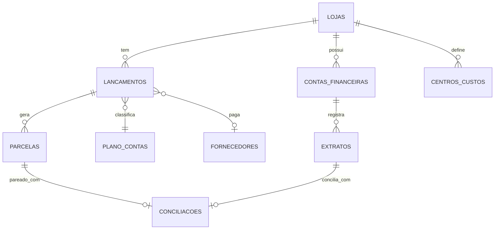
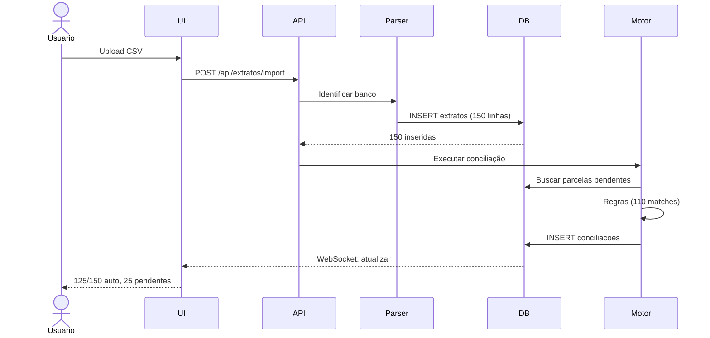
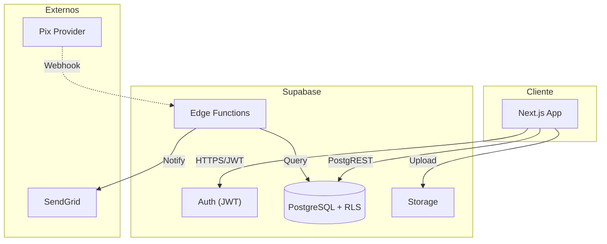

# 💰 PULSO Finance — Blueprint Técnico v2.0

> Sistema financeiro especializado para redes de óticas. Multi-loja, conciliação inteligente (Pix/Cartão/Boletos), DRE gerencial, fluxo de caixa projetado, IA de previsões/insights e Open Finance. Backend Supabase (Postgres + RLS), frontend Next.js 15.

**Status**: Aprovado para Implementação  
**Versão**: 2.0  
**Data**: Janeiro 2025  
**Autores**: Equipe PULSO Finance

---

## 📑 Índice

1. [Visão Geral](#1-visão-geral)
2. [Arquitetura de Alto Nível](#2-arquitetura-de-alto-nível)
3. [Decisões Arquiteturais (ADRs)](#3-decisões-arquiteturais-adrs)
4. [Modelo de Dados](#4-modelo-de-dados)
5. [Domínios Funcionais](#5-domínios-funcionais)
6. [Conciliação Bancária](#6-conciliação-bancária)
7. [IA & Business Intelligence](#7-ia--business-intelligence)
8. [Integrações](#8-integrações)
9. [Segurança e Compliance](#9-segurança-e-compliance)
10. [Extensões v2.0](#10-extensões-v20)
11. [Comparação Competitiva](#11-comparação-competitiva)
12. [Diagramas](#12-diagramas)
13. [Estrutura do Projeto](#13-estrutura-do-projeto)

---

## 1) Visão Geral

### 1.1 Nome e Missão

**Nome**: **PULSO Finance**  
**Tagline**: "O batimento do seu caixa em tempo real"  
**Missão**: Controlar e otimizar o fluxo de caixa de redes de óticas com previsões inteligentes e decisões acionáveis.

### 1.2 Princípios de Design

1. **Especialização Ótica**: Terminologia, fluxos e KPIs específicos do setor
2. **Governança Séria**: RLS, trilha de auditoria completa, segregação de funções
3. **Performance**: Índices estratégicos, views materializadas, P95 < 2s
4. **UX de Poucos Cliques**: CAD (Custo de Ação Desejada) < 30s
5. **Interoperabilidade**: CSV/API in/out, webhooks, Open Finance
6. **Explainable AI**: Insights sempre com justificativa rastreável

### 1.3 Diferenciadores

| Característica | PULSO Finance | Concorrentes |
|----------------|---------------|--------------|
| **Especialização** | Óticas (franquia %, comissões lentes) | Genérico |
| **Conciliação** | 70%+ automático (regras + IA) | Manual ou básico |
| **Multi-loja** | Nativo (RLS por loja) | Add-on caro |
| **Open Finance** | Sincronização automática | Apenas CSV |
| **Pix Programável** | Pagamentos automatizados | Não tem |
| **PULSO Score** | Gamificação 0-100 | Não tem |
| **Preço** | $99-299/mês | $125-500/mês |

---

## 2) Arquitetura de Alto Nível

### 2.1 Stack Tecnológico

```
┌─────────────────────────────────────────┐
│          FRONTEND (Vercel)              │
│  Next.js 15 (App Router) + React 18    │
│  Tailwind + shadcn/ui + TanStack Query │
└────────────┬────────────────────────────┘
             │ HTTPS/JWT
             ↓
┌─────────────────────────────────────────┐
│       BACKEND (Supabase Platform)       │
│  ┌──────────┐  ┌──────────┐  ┌───────┐ │
│  │PostgreSQL│  │  Storage │  │  Auth │ │
│  │   + RLS  │  │ (Anexos) │  │  JWT  │ │
│  └──────────┘  └──────────┘  └───────┘ │
│  ┌──────────────────────────────────┐  │
│  │   Edge Functions (Deno)          │  │
│  │   - Webhooks Pix                 │  │
│  │   - IA Pareamento                │  │
│  │   - Open Finance Sync            │  │
│  └──────────────────────────────────┘  │
└────────────┬────────────────────────────┘
             │
             ↓
┌─────────────────────────────────────────┐
│         INTEGRAÇÕES EXTERNAS            │
│  Pix Providers  │  Adquirentes  │  OCR │
│  Open Finance   │  WhatsApp     │  LLM │
└─────────────────────────────────────────┘
```

### 2.2 Camadas de Responsabilidade

| Camada | Tecnologia | Responsabilidade |
|--------|------------|------------------|
| **Apresentação** | Next.js SSR/CSR | UI, validação client, cache |
| **API** | Supabase PostgREST | CRUD automático, RLS |
| **Lógica de Negócio** | RPCs (PL/pgSQL) | Regras complexas, transações |
| **Dados** | PostgreSQL 15 | Persistência, integridade |
| **Jobs** | pg_cron + Edge Functions | Automações, integrações |
| **Armazenamento** | Supabase Storage | Anexos (NF, contratos) |
| **Observabilidade** | Sentry + Vercel Analytics | Erros, performance |

### 2.3 Fluxo de Dados Crítico

```
1. Usuário faz upload de extrato CSV
   ↓
2. Parser identifica banco (BB/Itaú/Santander)
   ↓
3. Normalização → INSERT INTO extratos (dedupe por hash)
   ↓
4. Trigger → event_bus('EXTRATO.NOVO')
   ↓
5. Edge Function → Motor de Conciliação
   ├─→ Regras determinísticas (70%)
   ├─→ IA de pareamento (20%)
   └─→ Pendências manuais (10%)
   ↓
6. Trigger → Atualiza parcelas.status='pago'
   ↓
7. CDC → Refresh views materializadas
   ↓
8. WebSocket → Atualiza dashboard em tempo real
```

---

## 3) Decisões Arquiteturais (ADRs)

### ADR-001: Backend - Supabase vs. Alternativas

**Status**: ✅ Aprovado  
**Decisão**: Supabase (Postgres + RLS + Edge Functions)

**Alternativas Avaliadas**:

| Solução | Prós | Contras | Score |
|---------|------|---------|-------|
| **Supabase** | ✅ Postgres (finanças), RLS nativo, $25/mês | ⚠️ Vendor lock-in moderado | 9/10 |
| Firebase | ✅ Maduro, Google Cloud | ❌ NoSQL (ruim p/ finanças) | 5/10 |
| Backend Custom | ✅ Controle total | ❌ 3x tempo dev, infra complexa | 6/10 |
| AWS Amplify | ✅ Integração AWS | ❌ DX ruim, caro | 4/10 |

**Justificativa**:
- Postgres é **mandatório** para integridade referencial financeira
- RLS elimina 90% dos bugs de autorização multi-tenant
- Edge Functions (Deno) para webhooks sem gerenciar servidores
- Custo previsível: $25/mês até 50 lojas

**Trade-offs Aceitos**:
- ⚠️ Vendor lock-in: mitigado por usar SQL padrão (migrável)
- ⚠️ Menos controle: aceitável para MVP

---

### ADR-002: Frontend - Next.js 15 (App Router)

**Status**: ✅ Aprovado  
**Decisão**: Next.js 15 com App Router (Server Components)

**Alternativas Avaliadas**:

| Solução | Prós | Contras | Score |
|---------|------|---------|-------|
| **Next.js 15** | ✅ Server Components, Vercel, shadcn/ui | ⚠️ Curva aprendizado | 9/10 |
| Remix | ✅ Web-first, nested routes | ❌ Ecossistema menor | 7/10 |
| SvelteKit | ✅ Performance, bundle pequeno | ❌ Time React | 6/10 |
| Vite+React SPA | ✅ Simples | ❌ Sem SSR | 5/10 |

**Justificativa**:
- Server Components = dashboards rápidos (fetch no servidor)
- Vercel = deploy automático + Edge Functions grátis
- shadcn/ui = componentes prontos e customizáveis
- Maior ecossistema React

---

### ADR-003: Conciliação - Motor Híbrido (Regras + IA)

**Status**: ✅ Aprovado  
**Decisão**: 3 camadas - Regras (70%) → IA (20%) → Manual (10%)

**Alternativas Avaliadas**:

| Abordagem | Prós | Contras | Score |
|-----------|------|---------|-------|
| **Híbrido** | ✅ Custo-benefício, escalável | ⚠️ Complexidade média | 9/10 |
| Apenas Regras | ✅ Simples | ❌ Auto-match < 60% | 6/10 |
| Apenas IA | ✅ Potencial 85%+ | ❌ Custo alto, dados | 5/10 |
| Terceirizado (Plaid) | ✅ Pronto | ❌ $0.25-1/transação | 3/10 |

**Justificativa**:
- Regras cobrem casos óbvios (doc_ref, Pix txid) = 70% sem custo
- IA trata edge cases = 20% adicional
- Manual para exceções = 10% aceitável
- Feedback loop: aprende com decisões manuais

**Implementação Faseada**:
- Sprint 3: Regras (meta 40-50%)
- Sprint 5: IA simples (meta 60-70%)
- Pós-MVP: IA avançada (meta 80%+)

---

### ADR-004: Autenticação - Supabase Auth + RLS

**Status**: ✅ Aprovado  
**Decisão**: Supabase Auth (JWT) + Row Level Security

**Justificativa**:
- RLS = segurança a nível de **linha** (usuário só vê suas lojas)
- Auditoria automática (auth.uid() em triggers)
- MFA nativo, OAuth providers
- Zero custo adicional

**Trade-offs Aceitos**:
- ⚠️ RLS pode degradar performance: mitigado por índices + views materializadas

---

### ADR-005: Estado Global - TanStack Query

**Status**: ✅ Aprovado  
**Decisão**: TanStack Query (server state) + React Context (UI state)

**Justificativa**:
- Cache automático, stale/refetch, otimista
- Separa server state (lancamentos) de UI state (modal)
- Zero prop drilling

---

### ADR-006: Testes - Vitest + Playwright

**Status**: ✅ Aprovado  
**Decisão**: Vitest (unit/integration) + Playwright (E2E)

**Justificativa**:
- Vitest = 5-10× mais rápido que Jest (ESM nativo)
- Playwright = multi-browser, stable
- Ambos TypeScript-first

**Cobertura Alvo**: Unit 70%, Integration 80%, E2E 90% (happy paths)

---

### ADR-007: Deployment - Vercel + Supabase

**Status**: ✅ Aprovado  
**Decisão**: Vercel (frontend) + Supabase (backend)

**Justificativa**:
- Vercel = especialista em Next.js
- Edge network global (< 100ms)
- Preview deploys automáticos
- $20/mês até 100k requests

---

## 4) Modelo de Dados

### 4.1 Enums

```sql
CREATE TYPE tipo_conta AS ENUM ('bancaria', 'caixa', 'investimento');
CREATE TYPE tipo_lancamento AS ENUM ('pagar', 'receber');
CREATE TYPE status_parcela AS ENUM ('previsto', 'vencido', 'pago', 'parcial', 'cancelado');
CREATE TYPE origem_lanc AS ENUM ('manual', 'import_csv', 'api', 'sistema', 'conciliacao');
CREATE TYPE direcao_pix AS ENUM ('in', 'out');
CREATE TYPE status_pix AS ENUM ('criado', 'liquidado', 'cancelado', 'estornado');
CREATE TYPE papel_usuario AS ENUM ('admin', 'supervisor', 'financeiro', 'gestor_loja', 'vendedor', 'leitor');
CREATE TYPE status_conciliacao AS ENUM ('pendente', 'aprovado', 'rejeitado');
CREATE TYPE tipo_contrato AS ENUM ('aluguel', 'franquia', 'servico', 'fornecedor');
```

### 4.2 Tabelas Principais (Core MVP)

```sql
-- ORGANIZAÇÃO
CREATE TABLE lojas (
  id UUID PRIMARY KEY DEFAULT gen_random_uuid(),
  nome TEXT NOT NULL,
  razao_social TEXT,
  cnpj TEXT UNIQUE,
  endereco JSONB,
  status BOOLEAN DEFAULT TRUE,
  created_at TIMESTAMPTZ DEFAULT NOW(),
  updated_at TIMESTAMPTZ DEFAULT NOW()
);

CREATE TABLE usuarios (
  id UUID PRIMARY KEY, -- auth.users.id
  email TEXT UNIQUE NOT NULL,
  nome TEXT NOT NULL,
  papel papel_usuario NOT NULL DEFAULT 'leitor',
  loja_ids UUID[] DEFAULT '{}', -- multi-tenant
  ativo BOOLEAN DEFAULT TRUE,
  ultimo_acesso TIMESTAMPTZ,
  created_at TIMESTAMPTZ DEFAULT NOW()
);

-- ESTRUTURA FINANCEIRA
CREATE TABLE contas_financeiras (
  id UUID PRIMARY KEY DEFAULT gen_random_uuid(),
  loja_id UUID NOT NULL REFERENCES lojas(id) ON DELETE CASCADE,
  tipo tipo_conta NOT NULL,
  banco TEXT,
  agencia TEXT,
  numero TEXT,
  apelido TEXT NOT NULL,
  saldo_inicial NUMERIC(14,2) DEFAULT 0,
  ativa BOOLEAN DEFAULT TRUE,
  created_at TIMESTAMPTZ DEFAULT NOW(),
  UNIQUE(loja_id, apelido)
);

CREATE TABLE plano_contas (
  id UUID PRIMARY KEY DEFAULT gen_random_uuid(),
  classe TEXT NOT NULL CHECK (classe IN ('receita','cmv','despesa','impostos','outros')),
  grupo TEXT NOT NULL,
  subgrupo TEXT,
  codigo TEXT UNIQUE NOT NULL,
  descricao TEXT NOT NULL,
  ativo BOOLEAN DEFAULT TRUE,
  created_at TIMESTAMPTZ DEFAULT NOW()
);

CREATE TABLE centros_custos (
  id UUID PRIMARY KEY DEFAULT gen_random_uuid(),
  loja_id UUID NOT NULL REFERENCES lojas(id) ON DELETE CASCADE,
  nome TEXT NOT NULL,
  descricao TEXT,
  ativo BOOLEAN DEFAULT TRUE,
  created_at TIMESTAMPTZ DEFAULT NOW(),
  UNIQUE(loja_id, nome)
);

CREATE TABLE fornecedores (
  id UUID PRIMARY KEY DEFAULT gen_random_uuid(),
  nome TEXT NOT NULL,
  tipo TEXT CHECK (tipo IN ('pessoa_fisica','pessoa_juridica')),
  doc TEXT,
  email TEXT,
  telefone TEXT,
  endereco JSONB,
  contato JSONB,
  observacoes TEXT,
  ativo BOOLEAN DEFAULT TRUE,
  created_at TIMESTAMPTZ DEFAULT NOW()
);

-- TRANSAÇÕES FINANCEIRAS
CREATE TABLE lancamentos (
  id UUID PRIMARY KEY DEFAULT gen_random_uuid(),
  loja_id UUID NOT NULL REFERENCES lojas(id) ON DELETE CASCADE,
  tipo tipo_lancamento NOT NULL,
  plano_id UUID REFERENCES plano_contas(id),
  centro_id UUID REFERENCES centros_custos(id),
  fornecedor_id UUID REFERENCES fornecedores(id),
  descricao TEXT NOT NULL,
  competencia DATE NOT NULL,
  valor_total NUMERIC(14,2) NOT NULL CHECK (valor_total > 0),
  num_parcelas INT NOT NULL DEFAULT 1 CHECK (num_parcelas > 0),
  origem origem_lanc DEFAULT 'manual',
  anexos TEXT[] DEFAULT '{}',
  observacoes TEXT,
  user_id UUID REFERENCES usuarios(id),
  aprovado_por UUID REFERENCES usuarios(id),
  aprovado_em TIMESTAMPTZ,
  created_at TIMESTAMPTZ DEFAULT NOW(),
  updated_at TIMESTAMPTZ DEFAULT NOW()
);

CREATE TABLE parcelas (
  id UUID PRIMARY KEY DEFAULT gen_random_uuid(),
  lancamento_id UUID NOT NULL REFERENCES lancamentos(id) ON DELETE CASCADE,
  parcela INT NOT NULL CHECK (parcela > 0),
  vencimento DATE NOT NULL,
  valor NUMERIC(14,2) NOT NULL CHECK (valor > 0),
  juros NUMERIC(14,2) DEFAULT 0,
  desconto NUMERIC(14,2) DEFAULT 0,
  valor_pago NUMERIC(14,2),
  status status_parcela NOT NULL DEFAULT 'previsto',
  pagamento_em TIMESTAMPTZ,
  conta_id UUID REFERENCES contas_financeiras(id),
  forma TEXT,
  comprovante TEXT,
  observacao TEXT,
  created_at TIMESTAMPTZ DEFAULT NOW(),
  updated_at TIMESTAMPTZ DEFAULT NOW(),
  UNIQUE(lancamento_id, parcela)
);

-- CONCILIAÇÃO
CREATE TABLE extratos (
  id UUID PRIMARY KEY DEFAULT gen_random_uuid(),
  conta_id UUID NOT NULL REFERENCES contas_financeiras(id) ON DELETE CASCADE,
  data TIMESTAMPTZ NOT NULL,
  historico TEXT NOT NULL,
  valor NUMERIC(14,2) NOT NULL,
  saldo_apos NUMERIC(14,2),
  doc_ref TEXT,
  origem TEXT NOT NULL,
  hash_duplo TEXT,
  processado BOOLEAN DEFAULT FALSE,
  created_at TIMESTAMPTZ DEFAULT NOW(),
  UNIQUE(conta_id, hash_duplo)
);

CREATE TABLE conciliacoes (
  id UUID PRIMARY KEY DEFAULT gen_random_uuid(),
  extrato_id UUID NOT NULL REFERENCES extratos(id) ON DELETE CASCADE,
  parcela_id UUID REFERENCES parcelas(id) ON DELETE CASCADE,
  regra TEXT NOT NULL,
  confianca NUMERIC(5,2) NOT NULL CHECK (confianca BETWEEN 0 AND 100),
  status status_conciliacao NOT NULL DEFAULT 'pendente',
  aprovado_por UUID REFERENCES usuarios(id),
  aprovado_em TIMESTAMPTZ,
  observacoes TEXT,
  created_at TIMESTAMPTZ DEFAULT NOW(),
  UNIQUE(extrato_id, parcela_id)
);

-- MEIOS DE PAGAMENTO
CREATE TABLE pix_transacoes (
  id UUID PRIMARY KEY DEFAULT gen_random_uuid(),
  loja_id UUID NOT NULL REFERENCES lojas(id) ON DELETE CASCADE,
  txid TEXT UNIQUE,
  e2eid TEXT UNIQUE,
  chave TEXT NOT NULL,
  valor NUMERIC(14,2) NOT NULL,
  direcao direcao_pix NOT NULL,
  status status_pix NOT NULL,
  pagador_nome TEXT,
  pagador_doc TEXT,
  criado_em TIMESTAMPTZ NOT NULL,
  liquidado_em TIMESTAMPTZ,
  provider TEXT NOT NULL,
  webhook_raw JSONB,
  parcela_id UUID REFERENCES parcelas(id),
  created_at TIMESTAMPTZ DEFAULT NOW()
);

CREATE TABLE cartao_transacoes (
  id UUID PRIMARY KEY DEFAULT gen_random_uuid(),
  loja_id UUID NOT NULL REFERENCES lojas(id) ON DELETE CASCADE,
  adquirente TEXT NOT NULL,
  bandeira TEXT NOT NULL,
  nsu TEXT UNIQUE NOT NULL,
  autorizacao TEXT,
  data_venda TIMESTAMPTZ NOT NULL,
  parcelas INT NOT NULL DEFAULT 1,
  bruto NUMERIC(14,2) NOT NULL,
  taxa_percentual NUMERIC(6,4) NOT NULL,
  taxa_fixa NUMERIC(8,2) DEFAULT 0,
  liquido NUMERIC(14,2) NOT NULL,
  previsto_em DATE NOT NULL,
  liquidado_em DATE,
  parcela_id UUID REFERENCES parcelas(id),
  created_at TIMESTAMPTZ DEFAULT NOW()
);

-- CONTRATOS
CREATE TABLE contratos (
  id UUID PRIMARY KEY DEFAULT gen_random_uuid(),
  loja_id UUID NOT NULL REFERENCES lojas(id) ON DELETE CASCADE,
  tipo tipo_contrato NOT NULL,
  fornecedor_id UUID REFERENCES fornecedores(id),
  descricao TEXT NOT NULL,
  valor_base NUMERIC(14,2) NOT NULL,
  indice_reajuste TEXT,
  data_base DATE NOT NULL,
  percentual NUMERIC(6,4),
  vencimento_dia INT CHECK (vencimento_dia BETWEEN 1 AND 31),
  plano_id UUID REFERENCES plano_contas(id),
  centro_id UUID REFERENCES centros_custos(id),
  arquivo TEXT,
  ativo BOOLEAN DEFAULT TRUE,
  inicio_vigencia DATE NOT NULL,
  fim_vigencia DATE,
  created_at TIMESTAMPTZ DEFAULT NOW(),
  updated_at TIMESTAMPTZ DEFAULT NOW()
);

-- VENDAS (opcional - fase 2)
CREATE TABLE vendedores (
  id UUID PRIMARY KEY DEFAULT gen_random_uuid(),
  loja_id UUID NOT NULL REFERENCES lojas(id) ON DELETE CASCADE,
  usuario_id UUID REFERENCES usuarios(id),
  nome TEXT NOT NULL,
  cpf TEXT UNIQUE,
  nivel TEXT,
  ativo BOOLEAN DEFAULT TRUE,
  created_at TIMESTAMPTZ DEFAULT NOW()
);

CREATE TABLE vendas_resumo (
  id UUID PRIMARY KEY DEFAULT gen_random_uuid(),
  loja_id UUID NOT NULL REFERENCES lojas(id) ON DELETE CASCADE,
  data DATE NOT NULL,
  categoria TEXT NOT NULL,
  bruto NUMERIC(14,2) NOT NULL,
  descontos NUMERIC(14,2) DEFAULT 0,
  custo NUMERIC(14,2),
  vendedor_id UUID REFERENCES vendedores(id),
  meio_pgto TEXT,
  origem TEXT DEFAULT 'import_csv',
  created_at TIMESTAMPTZ DEFAULT NOW(),
  UNIQUE(loja_id, data, categoria, vendedor_id, meio_pgto)
);

-- AUDITORIA & OBSERVABILIDADE
CREATE TABLE auditoria_financeira (
  id BIGSERIAL PRIMARY KEY,
  entidade TEXT NOT NULL,
  entidade_id UUID NOT NULL,
  acao TEXT NOT NULL,
  antes JSONB,
  depois JSONB,
  user_id UUID REFERENCES usuarios(id),
  ip INET,
  user_agent TEXT,
  correlation_id TEXT,
  em TIMESTAMPTZ DEFAULT NOW()
);

CREATE TABLE event_bus (
  id BIGSERIAL PRIMARY KEY,
  tipo TEXT NOT NULL,
  payload JSONB NOT NULL,
  criado_em TIMESTAMPTZ DEFAULT NOW(),
  processado_em TIMESTAMPTZ,
  erro TEXT
);
```

### 4.3 Índices Críticos

```sql
-- Performance em queries de dashboard
CREATE INDEX idx_parcelas_status_vencimento ON parcelas (status, vencimento) 
  WHERE status IN ('previsto', 'vencido');
CREATE INDEX idx_parcelas_lancamento ON parcelas (lancamento_id);

CREATE INDEX idx_extratos_conta_data ON extratos (conta_id, data DESC);
CREATE INDEX idx_extratos_processado ON extratos (processado) WHERE processado = FALSE;
CREATE INDEX idx_extratos_hash ON extratos USING HASH(hash_duplo);

CREATE INDEX idx_conciliacoes_status ON conciliacoes (status) WHERE status = 'pendente';
CREATE INDEX idx_conciliacoes_parcela ON conciliacoes (parcela_id);

CREATE INDEX idx_pix_loja_status ON pix_transacoes (loja_id, status, direcao);
CREATE INDEX idx_cartao_loja_previsto ON cartao_transacoes (loja_id, previsto_em);

CREATE INDEX idx_lancamentos_loja_comp ON lancamentos (loja_id, competencia DESC, tipo);
CREATE INDEX idx_lancamentos_descricao_fts ON lancamentos 
  USING GIN(to_tsvector('portuguese', descricao));

CREATE INDEX idx_auditoria_user_em ON auditoria_financeira (user_id, em DESC);
CREATE INDEX idx_auditoria_entidade ON auditoria_financeira (entidade, entidade_id);

CREATE INDEX idx_event_bus_pendente ON event_bus (criado_em) WHERE processado_em IS NULL;
```

### 4.4 Row Level Security (RLS) - Exemplo

```sql
-- Função helper
CREATE OR REPLACE FUNCTION tem_acesso_loja(loja UUID)
RETURNS BOOLEAN LANGUAGE SQL STABLE AS $$
  SELECT EXISTS (
    SELECT 1 FROM usuarios
    WHERE id = auth.uid()
      AND (papel = 'admin' OR loja = ANY(loja_ids))
      AND ativo = TRUE
  );
$$;

-- Política em lançamentos
ALTER TABLE lancamentos ENABLE ROW LEVEL SECURITY;

CREATE POLICY p_lancamentos_select ON lancamentos
  FOR SELECT USING (tem_acesso_loja(loja_id));

CREATE POLICY p_lancamentos_insert ON lancamentos
  FOR INSERT WITH CHECK (
    tem_acesso_loja(loja_id) AND
    EXISTS (
      SELECT 1 FROM usuarios
      WHERE id = auth.uid()
        AND papel IN ('admin','supervisor','financeiro','gestor_loja')
    )
  );

-- (Repetir para todas as tabelas críticas)
```

### 4.5 Views Materializadas

```sql
-- Fluxo de Caixa Projetado
CREATE VIEW vw_fluxo_caixa AS
SELECT p.vencimento::DATE AS dia,
       l.loja_id,
       SUM(CASE WHEN l.tipo='receber' THEN p.valor ELSE 0 END) AS entradas,
       SUM(CASE WHEN l.tipo='pagar' THEN p.valor ELSE 0 END) AS saidas
FROM parcelas p
JOIN lancamentos l ON l.id = p.lancamento_id
WHERE p.status IN ('previsto','vencido')
GROUP BY 1, 2;

-- DRE Mensal
CREATE VIEW vw_dre_mensal AS
SELECT DATE_TRUNC('month', vr.data) AS mes,
       vr.loja_id,
       SUM(vr.bruto - vr.descontos) AS receita_liquida,
       SUM(vr.custo) AS cmv,
       SUM(vr.bruto - vr.descontos - vr.custo) AS margem_bruta
FROM vendas_resumo vr
GROUP BY 1, 2;

-- Saldos Atualizados (materializada)
CREATE MATERIALIZED VIEW mv_saldos_contas AS
SELECT cf.id AS conta_id,
       cf.loja_id,
       cf.apelido,
       cf.saldo_inicial + COALESCE(SUM(e.valor), 0) AS saldo_atual,
       MAX(e.data) AS ultima_movimentacao
FROM contas_financeiras cf
LEFT JOIN extratos e ON e.conta_id = cf.id
WHERE cf.ativa = TRUE
GROUP BY cf.id, cf.loja_id, cf.apelido, cf.saldo_inicial;

CREATE UNIQUE INDEX ON mv_saldos_contas (conta_id);
```

### 4.6 RPCs Principais

```sql
-- Previsão de Caixa (média móvel)
CREATE OR REPLACE FUNCTION rpc_prever_caixa(
  p_loja_id UUID,
  p_dias INT DEFAULT 30
)
RETURNS TABLE(dia DATE, entradas_esperadas NUMERIC, saidas_esperadas NUMERIC)
LANGUAGE SQL STABLE AS $$
  WITH base AS (
    SELECT p.vencimento AS dia,
           SUM(CASE WHEN l.tipo='receber' THEN p.valor ELSE -p.valor END) AS neto
    FROM parcelas p
    JOIN lancamentos l ON l.id = p.lancamento_id
    WHERE l.loja_id = p_loja_id AND p.status = 'pago'
      AND p.pagamento_em >= NOW() - INTERVAL '60 days'
    GROUP BY 1
  ),
  media AS (
    SELECT AVG(CASE WHEN neto > 0 THEN neto ELSE 0 END) AS media_entradas,
           AVG(CASE WHEN neto < 0 THEN ABS(neto) ELSE 0 END) AS media_saidas
    FROM base
  )
  SELECT g::DATE,
         (SELECT media_entradas FROM media),
         (SELECT media_saidas FROM media)
  FROM generate_series(NOW()::DATE + 1, NOW()::DATE + p_dias, INTERVAL '1 day') g;
$$;

-- Conciliação por doc_ref
CREATE OR REPLACE FUNCTION rpc_conciliar_por_ref(p_doc_ref TEXT)
RETURNS INT LANGUAGE PLPGSQL AS $$
DECLARE v_count INT;
BEGIN
  WITH candidatos AS (
    SELECT e.id AS extrato_id,
           p.id AS parcela_id,
           95.0 AS confianca
    FROM extratos e
    JOIN parcelas p ON p.status IN ('previsto', 'vencido')
      AND ABS(e.valor - p.valor) < (p.valor * 0.05)
    WHERE e.doc_ref = p_doc_ref AND e.processado = FALSE
    ORDER BY ABS(e.valor - p.valor) ASC
    LIMIT 1
  )
  INSERT INTO conciliacoes (extrato_id, parcela_id, regra, confianca)
  SELECT extrato_id, parcela_id, 'DOC_REF_MATCH', confianca
  FROM candidatos
  ON CONFLICT DO NOTHING;
  
  GET DIAGNOSTICS v_count = ROW_COUNT;
  RETURN v_count;
END;
$$;

-- Aplicar reajuste de contrato
CREATE OR REPLACE FUNCTION rpc_reajustar_contrato(
  p_contrato_id UUID,
  p_indice_percentual NUMERIC,
  p_usuario_id UUID
)
RETURNS JSONB LANGUAGE PLPGSQL AS $$
DECLARE
  v_contrato RECORD;
  v_novo_valor NUMERIC;
BEGIN
  SELECT * INTO v_contrato FROM contratos WHERE id = p_contrato_id AND ativo = TRUE;
  
  IF NOT FOUND THEN
    RETURN jsonb_build_object('sucesso', FALSE, 'erro', 'Contrato não encontrado');
  END IF;
  
  v_novo_valor := v_contrato.valor_base * (1 + p_indice_percentual / 100);
  
  UPDATE contratos
  SET valor_base = v_novo_valor,
      data_base = NOW()::DATE,
      updated_at = NOW()
  WHERE id = p_contrato_id;
  
  INSERT INTO auditoria_financeira (entidade, entidade_id, acao, antes, depois, user_id)
  VALUES ('contrato', p_contrato_id, 'reajuste',
          to_jsonb(v_contrato),
          jsonb_build_object('valor_base', v_novo_valor, 'indice', p_indice_percentual),
          p_usuario_id);
  
  RETURN jsonb_build_object(
    'sucesso', TRUE,
    'valor_anterior', v_contrato.valor_base,
    'valor_novo', v_novo_valor,
    'percentual', p_indice_percentual
  );
END;
$$;
```

### 4.7 Triggers

```sql
-- Dedupe de extrato por hash
CREATE OR REPLACE FUNCTION trg_extrato_hash()
RETURNS TRIGGER LANGUAGE PLPGSQL AS $$
BEGIN
  NEW.hash_duplo := ENCODE(
    DIGEST(
      COALESCE(NEW.doc_ref, '') || 
      NEW.data::TEXT || 
      NEW.valor::TEXT ||
      NEW.historico,
      'sha256'
    ),
    'hex'
  );
  RETURN NEW;
END;
$$;

CREATE TRIGGER t_extrato_hash 
  BEFORE INSERT ON extratos
  FOR EACH ROW 
  EXECUTE FUNCTION trg_extrato_hash();

-- Atualizar updated_at
CREATE OR REPLACE FUNCTION trg_updated_at()
RETURNS TRIGGER LANGUAGE PLPGSQL AS $$
BEGIN
  NEW.updated_at := NOW();
  RETURN NEW;
END;
$$;

CREATE TRIGGER t_lancamentos_updated 
  BEFORE UPDATE ON lancamentos
  FOR EACH ROW 
  EXECUTE FUNCTION trg_updated_at();

-- Auditoria automática
CREATE OR REPLACE FUNCTION trg_auditoria()
RETURNS TRIGGER LANGUAGE PLPGSQL AS $$
DECLARE v_user_id UUID;
BEGIN
  v_user_id := COALESCE(auth.uid(), '00000000-0000-0000-0000-000000000000'::UUID);
  
  IF TG_OP = 'DELETE' THEN
    INSERT INTO auditoria_financeira (entidade, entidade_id, acao, antes, user_id)
    VALUES (TG_TABLE_NAME, OLD.id, 'delete', to_jsonb(OLD), v_user_id);
    RETURN OLD;
  ELSIF TG_OP = 'UPDATE' THEN
    INSERT INTO auditoria_financeira (entidade, entidade_id, acao, antes, depois, user_id)
    VALUES (TG_TABLE_NAME, NEW.id, 'update', to_jsonb(OLD), to_jsonb(NEW), v_user_id);
    RETURN NEW;
  ELSIF TG_OP = 'INSERT' THEN
    INSERT INTO auditoria_financeira (entidade, entidade_id, acao, depois, user_id)
    VALUES (TG_TABLE_NAME, NEW.id, 'insert', to_jsonb(NEW), v_user_id);
    RETURN NEW;
  END IF;
END;
$$;

CREATE TRIGGER t_audit_lancamentos 
  AFTER INSERT OR UPDATE OR DELETE ON lancamentos
  FOR EACH ROW EXECUTE FUNCTION trg_auditoria();
```

---

## 5) Domínios Funcionais

### 5.1 Dashboard Executivo

**Objetivo**: Visão 360° em < 5 segundos

**Componentes**:
- Saldo consolidado + por conta
- Agenda de vencimentos D+7 (pagar/receber)
- Dias de caixa disponível (cores: verde >15d, amarelo 8-15d, vermelho <8d)
- Gráfico de fluxo 30 dias (realizado + previsto)
- KPIs: Margem líquida, ticket médio, inadimplência %
- Alertas IA: "Taxa Stone acima da média" / "Caixa crítico em 5 dias"
- Seletor multi-loja (consolidado ou individual)

**Regras de Negócio**:
- Saldo = Saldo inicial + (Entradas realizadas - Saídas realizadas)
- Dias de caixa = Saldo atual / Média diária de saídas (últimos 30d)

### 5.2 Contas a Pagar / Receber (AP/AR)

**Funcionalidades**:
- Grid com filtros avançados (loja, status, plano, centro, período)
- Criação rápida com parcelamento inteligente
- Upload de anexos (NF, contrato, boleto)
- Split por centro de custo (ex: 50% vendas, 50% admin)
- Ações em lote: baixar, reagendar, renegociar
- Workflow: Rascunho → Aprovado → Pago/Recebido

**Parcelamento Inteligente**:
- Entrada + N parcelas (ex: R$ 1.000 = R$ 400 entrada + 3x R$ 200)
- Vencimentos personalizados
- Juros simples ou compostos (manual)

**Validações**:
- Plano de contas obrigatório para DRE
- Centro de custo obrigatório se loja tem >1 CC
- Fornecedor obrigatório em "Pagar" > R$ 1.000

### 5.3 Fluxo de Caixa & Projeções

**Visualizações**:
- Calendário mensal (dia a dia): barras de entrada/saída
- Curva acumulada (realizado vs. previsto)
- Cenários what-if: "E se atrasar 50% dos recebimentos?"
- Simulador de antecipação: custo vs. benefício

**Previsão (Motor v1)**:
- Média móvel ponderada (últimos 60 dias)
- Ajuste sazonal (feriados, campanhas)
- Recorrências (aluguel, franquia, folha)
- Margem de erro: MAPE < 20% (meta 15% em 60d)

**Alertas Proativos**:
- Caixa insuficiente em D+X
- Concentração de vencimentos
- Oportunidade de antecipação

### 5.4 DRE Gerencial

**Estrutura Padrão Óticas**:
```
RECEITA BRUTA
  Venda de Armações
  Venda de Lentes (Monofocais/Multifocais/Progressivas)
  Serviços (Consultas/Ajustes/Reparos)
(-) Descontos
(-) Impostos sobre vendas
= RECEITA LÍQUIDA

(-) CMV
  Compra de Armações
  Compra de Lentes
  Frete de Compras
= MARGEM BRUTA

(-) DESPESAS OPERACIONAIS
  Pessoal (salários, comissões, encargos)
  Aluguel
  Marketing
  Administrativas
  Franquia (se aplicável)
= EBITDA

(-) Depreciação/Amortização
(-) Juros
= LUCRO LÍQUIDO
```

**Funcionalidades**:
- Visão mensal, trimestral, anual
- Comparativo: mês vs. mês anterior, mês vs. mesmo mês ano anterior
- Drill-down: clica em "Aluguel" → vê todas as parcelas
- Consolidado + individual por loja
- Export Excel formatado

### 5.5 Contratos e Obrigações Recorrentes

**Tipos de Contrato**:
1. **Aluguel**: Valor fixo, dia fixo, reajuste anual (IGPM/IPCA)
2. **Franquia**: Percentual sobre faturamento bruto (ex: 5%)
3. **Serviços**: Limpeza, segurança, contabilidade (valor fixo)

**Automação**:
- pg_cron diário: gera lançamento "Pagar" no dia D-5 do vencimento
- Status inicial: "Rascunho" (financeiro revisa e aprova)
- Reajuste: job anual verifica aniversário → aplica índice → gera alerta

**Reajuste de Aluguel (exemplo)**:
```
Contrato: R$ 3.000 (base: jan/2024, índice: IGPM)
Aniversário: jan/2025
IGPM acumulado: 4,35%
Novo valor: R$ 3.000 × 1,0435 = R$ 3.130,50
Sistema: Cria rascunho + notifica gestor
```

### 5.6 Comissões e Metas (Fase 2)

**Estrutura de Regras**:
```json
{
  "vendedor": "João Silva",
  "loja": "Mauá",
  "periodo": "2025-09",
  "regras": [
    {"categoria": "armacao", "percentual": 0.03},
    {"categoria": "lente", "percentual": 0.02},
    {
      "categoria": "servico",
      "tipo": "faixa",
      "faixas": [
        {"min": 0, "max": 1000, "percentual": 0.05},
        {"min": 1001, "max": 3000, "percentual": 0.08},
        {"min": 3001, "max": 999999, "percentual": 0.10}
      ]
    }
  ]
}
```

### 5.7 BI & Copiloto (IA)

**Q&A Natural**:
```
Usuário: "Qual a margem bruta da loja Mauá em agosto?"
Copiloto: 
  1. Identifica: loja=Mauá, período=ago/25, métrica=margem_bruta
  2. Gera SQL: SELECT ... FROM vw_dre_mensal WHERE ...
  3. Responde: "A margem bruta foi R$ 45.320 (38% da receita)"
```

**Segurança**:
- Whitelist de views: apenas `vw_*`
- RLS aplicado: vendedor não vê custo
- Logs de todas as perguntas

**Insights Proativos**:
- "Taxa Visa aumentou 0,3% vs. mês passado"
- "Inadimplência 15% acima da média"
- "Dias de caixa cairão para 8 em 12 dias"

**Detecção de Anomalias**:
- Isolation Forest/Z-score
- Casos: despesas 2× acima da média
- Notificação: alerta no dashboard + email

### 5.8 Admin & Governança

**Módulos**:
1. Usuários & Permissões (CRUD + matriz de papéis)
2. Plano de Contas (hierarquia customizável)
3. Centros de Custo (ativo/inativo)
4. Integrações (tokens API, mapeamento CSV)
5. Auditoria (filtros por usuário/entidade/período)

**Matriz de Permissões**:

| Recurso | admin | supervisor | financeiro | gestor_loja | vendedor | leitor |
|---------|:-----:|:----------:|:----------:|:-----------:|:--------:|:------:|
| Dashboard | R/W | R | R | R | R | R |
| Lançamentos | R/W | R/W | R/W | R/W | R | R |
| Conciliação | R/W | R/W | R/W | R | - | - |
| Fluxo & DRE | R/W | R | R | R | - | R |
| Contratos | R/W | R | R | R | - | - |
| Comissões | R/W | R/W | R | R | R | - |
| Config | R/W | R | R | - | - | - |

---

## 6) Conciliação Bancária

### 6.1 Arquitetura do Motor

```
┌───────────────────────────────────────────┐
│  1. INGESTÃO & NORMALIZAÇÃO               │
│  CSV Bank/API Pix → extratos              │
└────────────────┬──────────────────────────┘
                 ↓
┌───────────────────────────────────────────┐
│  2. MOTOR DE PAREAMENTO                   │
│  ├─ Camada 1: Regras Determinísticas 70% │
│  ├─ Camada 2: IA Score 0-100 (20%)        │
│  └─ Camada 3: Manual Assistido (10%)     │
└────────────────┬──────────────────────────┘
                 ↓
┌───────────────────────────────────────────┐
│  3. APROVAÇÃO & EFEITOS                   │
│  parcelas.status='pago' + event_bus       │
└───────────────────────────────────────────┘
```

### 6.2 Regras Determinísticas

**Regra 1: DOC_REF_MATCH (95% confiança)**
- `extrato.doc_ref` = `parcela.id` OU
- `extrato.doc_ref` = `pix_transacoes.e2eid` OU
- `extrato.doc_ref` = `cartao_transacoes.nsu`

**Regra 2: PIX_TXID (98% confiança)**
- `extrato.doc_ref` casa com `pix_transacoes.txid`

**Regra 3: VALUE_DATE_NEAR (80% confiança)**
- `|extrato.valor - parcela.valor|` < 2%
- `|extrato.data - parcela.vencimento|` ≤ 2 dias

**Regra 4: CARTAO_NSU (90% confiança)**
- `extrato.doc_ref` = `cartao_transacoes.nsu`
- Considera taxa de adquirente (valor líquido)

### 6.3 IA de Pareamento

**Features**:
- `valor_diff_pct`: diferença percentual de valor
- `dias_diff`: diferença em dias entre data e vencimento
- `n_gramas`: similaridade textual do histórico
- `hora_dia`, `dia_semana`: padrões temporais
- `loja_id`: padrões específicos por loja

**Modelo**: XGBoost ou Random Forest (leve, roda no Edge)

**Score**: 0-100 → se >70, sugere para aprovação

**Feedback Loop**: usuário confirma/rejeita → retreino semanal

### 6.4 Parsers por Banco

```typescript
// lib/parsers/banco-do-brasil.ts
export function parseBancoDoBrasil(csvText: string) {
  const result = Papa.parse(csvText, {
    header: true,
    skipEmptyLines: true,
    transformHeader: (h) => h.trim().toLowerCase()
  });

  return result.data.map((row: any) => ({
    data: parseDate(row.data), // dd/mm/yyyy → ISO
    historico: row.histórico || row.descricao,
    valor: parseFloat(row.valor.replace('.', '').replace(',', '.')),
    doc_ref: row.documento || null,
    origem: 'csv_bb'
  }));
}
```

### 6.5 Dicionário de Normalização

```sql
CREATE TABLE dicionario_historico (
  banco TEXT NOT NULL,
  termo_original TEXT NOT NULL,
  termo_normalizado TEXT NOT NULL,
  PRIMARY KEY (banco, termo_original)
);

INSERT INTO dicionario_historico VALUES
  ('bb', 'PIX RECEB', 'PIX_IN'),
  ('bb', 'PIX ENVIADO', 'PIX_OUT'),
  ('bb', 'TED ENVIADA', 'TED_OUT'),
  ('itau', 'Pix recebido', 'PIX_IN');
```

---

## 7) IA & Business Intelligence

### 7.1 Forecast de Caixa

**Motor v1 (MVP)**: Média móvel ponderada
- Últimos 60 dias
- Ajuste sazonal (feriados cadastrados)
- Recorrências (aluguel, franquia)
- MAPE esperado: 20-25%

**Motor v2 (Pós-MVP)**: Prophet/ARIMA
- Sazonalidade complexa (Black Friday, Dia das Mães)
- Features: dias úteis, campanhas
- Integração com metas de vendas
- MAPE esperado: 12-18%

### 7.2 Detecção de Anomalias

**Algoritmo**: Isolation Forest ou Z-score

**Casos**:
- Despesas 2× acima da média
- Vendas 50% abaixo do esperado
- Taxas de adquirente acima do P95

**Notificação**: Alerta no dashboard + email

### 7.3 Recomendações Acionáveis

```
Insight: "Taxas de cartão R$ 1.200 acima do esperado"
Ação: "Migrar 30% das vendas para Pix (economia ~R$ 800)"
Justificativa: "Taxa média cartão: 3,2% vs. Pix: 0,99%"
```

### 7.4 Q&A Natural (LLM)

**Implementação**:
- LLM: Claude/GPT via API
- Function calling: traduz pergunta → SQL
- Whitelist: apenas views `vw_*`
- Logging: todas as perguntas em `auditoria_financeira`

**Segurança**:
- RLS aplicado (vendedor não vê custo)
- Rate limiting (10 perguntas/min por usuário)
- Sanitização de entrada

---

## 8) Integrações

### 8.1 CSV - Padrão PULSO

**Extratos Bancários**:
```csv
conta_apelido,data_iso,historico,valor,saldo_apos,doc_ref
CAIXA_MAUA,2025-09-04T14:22:00,PIX RECEBIDO CLIENTE X,350.00,20450.22,E2E123...
```

**Lançamentos**:
```csv
loja,tipo,plano_codigo,centro_nome,descricao,competencia,vencimento,valor_total,fornecedor,num_parcelas
MAUA,pagar,DESP.ALG,ADM,Aluguel Set/25,2025-09-01,2025-09-10,3402.12,Imobiliaria Z,1
```

### 8.2 Webhooks Pix (Edge Function)

```typescript
// supabase/functions/webhook-pix/index.ts
serve(async (req) => {
  const signature = req.headers.get('X-Signature');
  if (!validateSignature(signature, await req.text())) {
    return new Response('Unauthorized', { status: 401 });
  }

  const payload = await req.json();
  
  if (payload.event === 'pix.received') {
    await supabase.from('pix_transacoes').insert({
      loja_id: mapAccountToLoja(payload.account_id),
      txid: payload.txid,
      e2eid: payload.endToEndId,
      valor: payload.amount,
      direcao: 'in',
      status: 'liquidado',
      liquidado_em: payload.timestamp,
      provider: 'stripe',
      webhook_raw: payload
    });

    // Tentar pareamento automático
    await supabase.rpc('rpc_conciliar_por_ref', {
      p_doc_ref: payload.endToEndId
    });
  }

  return new Response('OK');
});
```

### 8.3 Adquirentes (CSV → API futura)

**Fase 1**: CSV manual
**Fase 2**: API polling (Stone, Cielo, Rede)

```typescript
async function fetchStoneTransacoes(loja_id: string, desde: Date) {
  const response = await fetch('https://api.stone.com.br/v1/transactions', {
    headers: {
      'Authorization': `Bearer ${STONE_API_KEY}`,
      'Content-Type': 'application/json'
    },
    body: JSON.stringify({
      merchant_id: getMerchantId(loja_id),
      start_date: desde.toISOString()
    })
  });

  const data = await response.json();
  
  return data.transactions.map((t: any) => ({
    loja_id,
    adquirente: 'stone',
    bandeira: t.card_brand,
    nsu: t.nsu,
    data_venda: t.created_at,
    parcelas: t.installments,
    bruto: t.amount,
    taxa_percentual: t.mdr_rate,
    liquido: t.net_amount,
    previsto_em: t.settlement_date
  }));
}
```

---

## 9) Segurança e Compliance

### 9.1 Camadas de Segurança

```
1. Autenticação (Supabase Auth)
   ├─ Email/Password + MFA (TOTP)
   └─ JWT com expiração 1h

2. Autorização (RLS)
   ├─ Row-level por loja
   └─ Papel (admin/financeiro/vendedor)

3. Validação de Entrada
   ├─ Zod (frontend + Edge)
   └─ CHECK constraints (banco)

4. Criptografia
   ├─ TLS 1.3 (HTTPS)
   ├─ Tokens externos (AES-256)
   └─ Anexos (Storage privado)

5. Auditoria
   ├─ Logs de acesso (IP + User-Agent)
   ├─ Trilha de alterações
   └─ Retenção 90 dias

6. Rate Limiting
   ├─ Supabase: 100 req/s por IP
   └─ Edge Functions: 10 req/min por user
```

### 9.2 Gerenciamento de Segredos

**Supabase Vault**:
```sql
-- Armazenar API keys criptografadas
INSERT INTO vault.secrets (secret, name, description)
VALUES ('sk_live_abc123...', 'pix_provider_key', 'Chave API Pix');

-- Usar em Edge Function
CREATE OR REPLACE FUNCTION get_pix_key()
RETURNS TEXT LANGUAGE PLPGSQL SECURITY DEFINER AS $$
BEGIN
  RETURN vault.decrypt_secret(
    (SELECT secret FROM vault.secrets WHERE name = 'pix_provider_key')
  );
END;
$$;
```

**Rotação de Chaves**: Trimestral

### 9.3 Compliance LGPD

**Dados Pessoais**:
- CPF/CNPJ de fornecedores (essencial para operação)
- Email/telefone de usuários (Supabase Auth)

**Direitos do Titular**:
1. **Acesso**: export JSON de todos os dados
2. **Correção**: CRUD completo via UI
3. **Exclusão**: soft delete (ativo=false) + hard delete após 90 dias
4. **Portabilidade**: export CSV/JSON

**Consentimento**:
- Aceite de termos no primeiro login
- Registro em `auditoria_financeira`

---

## 10) Extensões v2.0

### 10.1 Open Finance — Agregação Automática

**Objetivo**: Eliminar CSV, sincronizar extratos automaticamente

**Novas Tabelas**:
```sql
CREATE TABLE openfinance_connections (
  id UUID PRIMARY KEY DEFAULT gen_random_uuid(),
  loja_id UUID REFERENCES lojas(id),
  provider TEXT NOT NULL, -- 'pluggy'|'belvo'
  access_token_enc TEXT NOT NULL,
  consent_id TEXT,
  status TEXT DEFAULT 'ativo',
  expires_at TIMESTAMPTZ,
  created_at TIMESTAMPTZ DEFAULT NOW()
);

CREATE TABLE bank_accounts_external (
  id UUID PRIMARY KEY DEFAULT gen_random_uuid(),
  connection_id UUID REFERENCES openfinance_connections(id),
  external_id TEXT,
  apelido TEXT,
  banco TEXT,
  last_sync TIMESTAMPTZ
);
```

**Mapeamento**:
```sql
CREATE OR REPLACE FUNCTION rpc_sync_openfinance(
  account UUID,
  conta_destino UUID
)
RETURNS INT AS $$
  INSERT INTO extratos (conta_id, data, historico, valor, origem, hash_duplo)
  SELECT conta_destino, occurred_at, description, amount, 'api_openfinance', hash_duplo
  FROM bank_transactions_external
  WHERE account_id = account
  ON CONFLICT (hash_duplo) DO NOTHING;
$$;
```

**Jobs**: `*/15 * * * *` → Pull de cada provider ativo

### 10.2 Pix Programável (Pix Out)

**Objetivo**: Automatizar pagamentos a fornecedores

**Novas Tabelas**:
```sql
CREATE TABLE pix_pagamentos (
  id UUID PRIMARY KEY DEFAULT gen_random_uuid(),
  loja_id UUID REFERENCES lojas(id),
  fornecedor_id UUID REFERENCES fornecedores(id),
  chave_pix TEXT NOT NULL,
  valor NUMERIC(14,2) NOT NULL,
  agendado_em TIMESTAMPTZ,
  status TEXT DEFAULT 'rascunho', -- rascunho/aprovacao/agendado/enviado/confirmado
  provider_txid TEXT,
  criado_por UUID REFERENCES usuarios(id)
);

CREATE TABLE payment_approvals (
  id UUID PRIMARY KEY DEFAULT gen_random_uuid(),
  pagamento_id UUID REFERENCES pix_pagamentos(id),
  aprovado_por UUID REFERENCES usuarios(id),
  aprovado_em TIMESTAMPTZ,
  status TEXT -- aprovado/reprovado
);
```

**Fluxo**:
1. Seleciona `parcelas` vencendo → "Gerar Pix Pagamento"
2. Workflow dupla aprovação (>=2 aprovadores)
3. Edge Function cria ordem no provider
4. Ao confirmar → marca `parcelas.status='pago'`

### 10.3 PULSO Score (0-100)

**Objetivo**: Gamificar saúde financeira

**Componentes e Pesos**:
- **Liquidez (LQ)** — dias de caixa (30%)
- **Margem Bruta (MB)** — % mensal (25%)
- **Pontualidade (PT)** — % parcelas pagas em dia (20%)
- **Previsibilidade (PV)** — MAPE invertido (15%)
- **Conciliação (CC)** — % auto-match (10%)

**View**:
```sql
CREATE VIEW vw_pulso_score_mensal AS
WITH base AS (
  SELECT l.id AS loja_id,
         COALESCE((SELECT AVG(dias) FROM vw_dias_de_caixa WHERE loja_id=l.id), 0) AS lq_dias,
         COALESCE((SELECT margem FROM vw_dre_mensal WHERE loja_id=l.id), 0) AS mb,
         -- ... outros componentes
  FROM lojas l
)
SELECT loja_id,
       ROUND(
         (norm_lq(lq_dias)*0.30) + 
         (norm_mb(mb)*0.25) + 
         (norm_pt(pt)*0.20) + 
         (norm_pv(pv)*0.15) + 
         (norm_cc(cc)*0.10),
         2
       ) AS pulso_score
FROM base;
```

**UX**: Card com cor (vermelho <50, amarelo 50-74, verde 75+)

### 10.4 OCR de Comprovantes

**Objetivo**: Reduzir digitação manual

**Tabela**:
```sql
CREATE TABLE anexos_processados (
  id UUID PRIMARY KEY DEFAULT gen_random_uuid(),
  url TEXT NOT NULL,
  tipo TEXT, -- boleto/comprovante/nf
  extraido JSONB, -- {"valor":..., "vencimento":..., "fornecedor":...}
  confianca NUMERIC(5,2),
  status TEXT DEFAULT 'novo',
  criado_em TIMESTAMPTZ DEFAULT NOW()
);
```

**Pipeline**:
1. Upload → event_bus
2. Edge `/ocr/run` chama OCR (Tesseract/Azure)
3. Sugere rascunho de lançamento
4. Usuário confirma/edita

### 10.5 Relatórios Narrativos IA

**Objetivo**: Comunicação executiva automática

**Tabela**:
```sql
CREATE TABLE reports_mensais (
  id UUID PRIMARY KEY DEFAULT gen_random_uuid(),
  loja_id UUID REFERENCES lojas(id),
  mes DATE NOT NULL,
  resumo_md TEXT, -- markdown gerado por LLM
  gerado_em TIMESTAMPTZ DEFAULT NOW()
);
```

**RPC**: `rpc_gerar_relatorio_mensal(loja_id, mes)`
- Consulta views (DRE, fluxo, score)
- Chama LLM (Claude/GPT)
- Salva `resumo_md`

**Job**: Mensal no dia 1 às 7h

### 10.6 Exportação Contábil

**Objetivo**: Integração com escritório

**Mapeamento**:
```sql
CREATE TABLE plano_contas_mapeamento (
  conta_id UUID REFERENCES plano_contas(id),
  sistema TEXT, -- 'sped'|'nibo'|'omie'
  codigo_externo TEXT,
  PRIMARY KEY (conta_id, sistema)
);
```

**RPC**: `rpc_export_contabilidade(mes, sistema)`
- Gera CSV/Excel em Storage
- Cron mensal pós-fechamento

### 10.7 Ranking de Adquirentes

**Objetivo**: Otimizar taxas

**View**:
```sql
CREATE VIEW vw_ranking_adquirentes AS
SELECT loja_id,
       adquirente,
       bandeira,
       AVG(taxa_percentual) AS taxa_media,
       AVG(CASE WHEN liquidado_em IS NOT NULL 
           THEN (liquidado_em - previsto_em) 
           ELSE INTERVAL '0 day' END) AS atraso_medio,
       COUNT(*) AS transacoes
FROM cartao_transacoes
GROUP BY 1, 2, 3;
```

**Insight**: Custo efetivo = MDR + (custo antecipação × atraso)

### 10.8 Planejamento Semanal Assistido

**Objetivo**: Disciplina de tesouraria

**Tabela**:
```sql
CREATE TABLE planejamento_semanal (
  id UUID PRIMARY KEY DEFAULT gen_random_uuid(),
  loja_id UUID REFERENCES lojas(id),
  semana DATE NOT NULL, -- segunda-feira
  plano JSONB, -- lista de ações
  status TEXT DEFAULT 'gerado',
  criado_em TIMESTAMPTZ DEFAULT NOW()
);
```

**Algoritmo (Edge)**:
1. Projeção D+14 + agenda de vencimentos
2. Gera plano (ordem ótima de pagamentos)
3. Envia checklist (WhatsApp/dashboard)

---

## 11) Comparação Competitiva

| Sistema | Preço/mês | Pontos Fortes | Pontos Fracos | PULSO Vantagem |
|---------|-----------|---------------|---------------|----------------|
| **Conta Azul** | R$ 89-289 | ✅ Maduro, NFe | ❌ Genérico, sem multi-loja | ✅ Especialização ótica |
| **Omie** | R$ 125-499 | ✅ Completo, API | ❌ Complexo | ✅ Simples, onboarding 15min |
| **Granatum** | R$ 69-299 | ✅ Fluxo de caixa | ❌ Conciliação manual | ✅ Auto-match 70%+ |
| **Nibo** | R$ 119-299 | ✅ PME | ❌ Conciliação fraca | ✅ IA de pareamento |
| **QuickBooks** | $30-200 | ✅ Gigante | ❌ Caro, internacional | ✅ BR-native, Pix |
| **Excel** | R$ 0 | ✅ Grátis | ❌ Erro humano | ✅ Automação |

**Nosso Posicionamento**: Alto Valor + Preço Justo + Especialização

---

## 12) Diagramas

### 12.1 Diagrama ER (Simplificado)



### 12.2 Fluxo de Conciliação



### 12.3 Arquitetura C4 (Containers)



---

## 13) Estrutura do Projeto

```
pulso-finance/
│
├── .github/
│   └── workflows/
│       ├── deploy.yml
│       ├── test.yml
│       └── security.yml
│
├── apps/
│   └── web/
│       ├── app/
│       │   ├── (auth)/
│       │   ├── (dashboard)/
│       │   │   ├── page.tsx
│       │   │   ├── lancamentos/
│       │   │   ├── conciliacao/
│       │   │   ├── fluxo/
│       │   │   ├── dre/
│       │   │   └── configuracoes/
│       │   └── api/
│       │       └── webhooks/pix/route.ts
│       │
│       ├── components/
│       │   ├── ui/              # shadcn/ui
│       │   ├── dashboard/
│       │   ├── lancamentos/
│       │   ├── conciliacao/
│       │   └── layout/
│       │
│       ├── lib/
│       │   ├── supabase/
│       │   ├── utils/
│       │   ├── hooks/
│       │   ├── parsers/
│       │   └── validations/
│       │
│       └── styles/
│
├── supabase/
│   ├── migrations/
│   │   └── 20250101_initial_schema.sql
│   ├── functions/
│   │   ├── webhook-pix/
│   │   ├── ia-pareamento/
│   │   └── sync-openfinance/
│   └── seed.sql
│
├── __tests__/
│   ├── unit/
│   ├── integration/
│   └── e2e/
│
├── docs/
│   ├── BLUEPRINT.md           # Este documento
│   ├── ROADMAP.md
│   └── adr/
│
└── package.json
```

---

## 14) Próximos Passos

1. **Validar com Stakeholders** (seção de Domínios + Extensões v2.0)
2. **Gerar ROADMAP.md** (sprints, timeline, custos)
3. **Setup Técnico** (repo + Supabase + Vercel)
4. **Sprint 01 Kickoff** (DDL + CRUD + Dashboard v0)

---

**Versão**: 2.0  
**Última Atualização**: Janeiro 2025  
**Autoria**: Equipe PULSO Finance  
**Licença**: Confidencial — Uso Interno